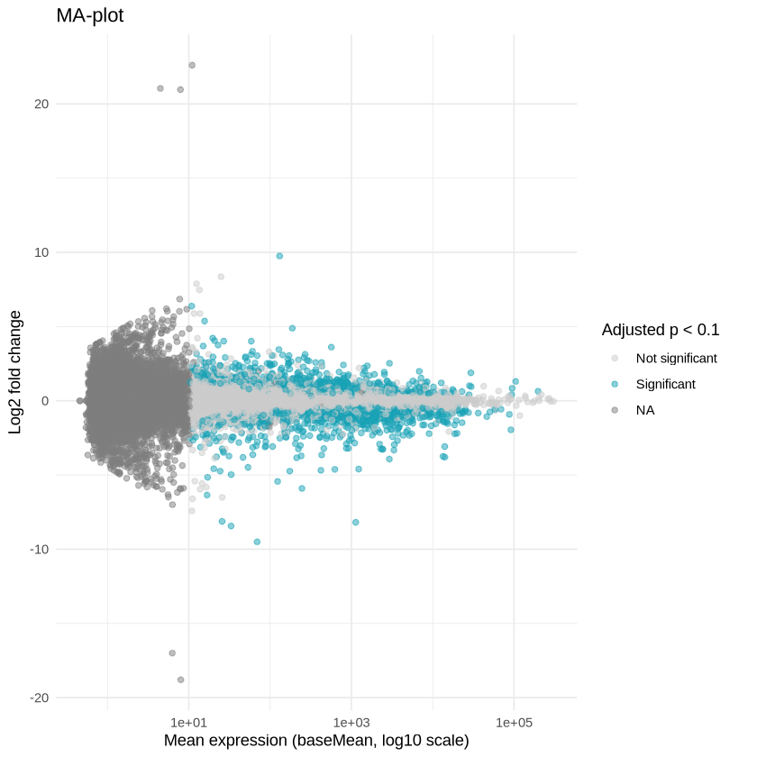

# BioConductor RNA Seq Workflow

## Introduction

This RNA-Seq tutorial was based on several existing tutorials, including this excellent tutorial by [Michael Love et al.](https://www.bioconductor.org/help/course-materials/2019/CSAMA/materials/labs/lab-03-rnaseq/rnaseqGene_CSAMA2019.html?utm_source=perplexity#experimental-data), the [Griffith lab RNA-Seq course](https://rnabio.org/course/), and [Tommy Tang's tutorials](https://divingintogeneticsandgenomics.com/post/downstream-of-bulk-rnaseq-read-in-salmon-output-using-tximport-and-then-deseq2/).

Although each of these tutorials are great resources, they skip over some key steps that are difficult for beginners, including data acquisition and tool installation. The purpose of this tutorial is to provide a clear and concise example of RNA-Seq analysis with minimal set up for members of our group with our lab equipment in mind. For example, the EE server behaves more like a Linux PC rather than an HPC like CityU Burgundy - although we still do not have sudo permission. Therefore, everything must be installed via conda.

The step-by-step instructions to follow are currently stored in the steps.md file. A breakdown of these steps is below.

## Overview

The first step is to download the dataset and additional files needed for mapping the reads. We will then perform QC (to be added) to remove poor quality data followed by read mapping and quantification. The data is then read into R for differential expression analysis.

## Mapping

In this tutorial we will use salmon and fastqc installed via conda.

## Differential Expression Analysis

First, the data will be imported into R with tximport, then DESeq2 will be used for the analysis.

In the tutorial you will perform QC first and then produce a number of graphs to visualise your results. An example of this is the MA plot below:

